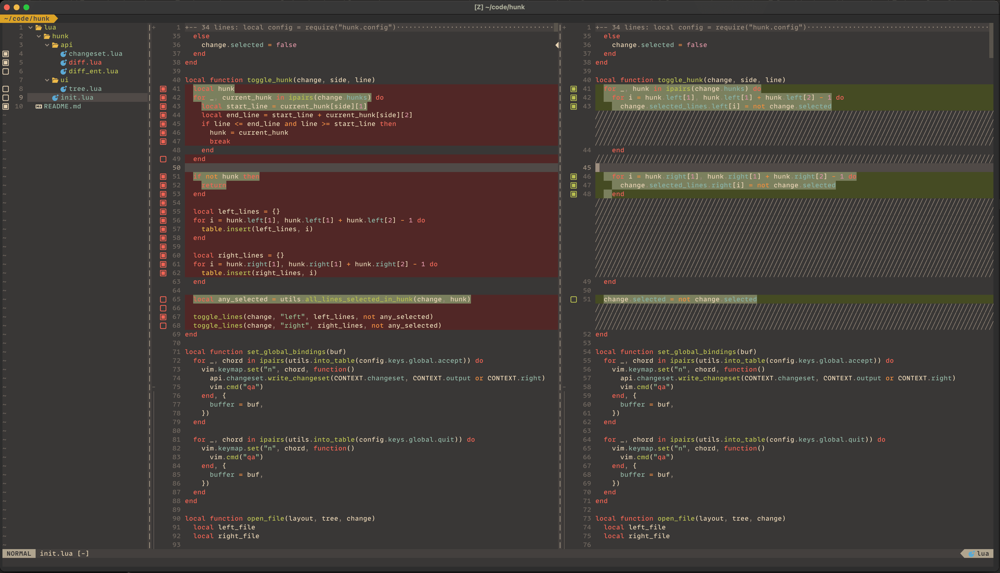

<div align="center">
  <h1>hunk.nvim</h1>
</div>

<div align="center">
  <p>
    A tool for splitting diffs in Neovim
  </p>
</div>

This is a Neovim tool for splitting/editing diffs. It operates over a `left` and `right` directory, producing a diff of
the two which can subsequently be inspected and modified. The `DiffEditor` allows selecting changes by file, hunk or
individual line to produce a new partial diff.

This was primarily built to be used with [jujutsu](https://github.com/martinvonz/jj) as an alternative diff-editor to
it's `:builtin` option, but it's designed generically enough that it can be used for other use cases.

To use it you need to give it two to three directories: a `left`, a `right`, and optionally a `output` directory. These
directories will then be read in and used to produce a set of diffs between the two directories. You will then be
presented with the left and right side of each file and can select the lines from each diff hunk you would like to keep.

When you are happy with your selection you can accept changes and the diff editor will modify the `output` directory (or
the `right` directory if no output is provided) to match your selection.



## Installation

### Using [folke/lazy.vim](https://github.com/folke/lazy.nvim)

```lua
{
  "julienvincent/hunk.nvim",
  cmd = { "DiffEditor" },
  config = function()
    require("hunk").setup()
  end,
}
```

### Dependencies

+ [nui.nvim](https://github.com/MunifTanjim/nui.nvim)
+ [nvim-web-devicons](https://github.com/nvim-tree/nvim-web-devicons) (optional)
+ [mini.icons](https://github.com/echasnovski/mini.icons) (optional)

If you want file type icons in the file tree then you should have one of either `mini.icons` or `nvim-web-devicons`
installed. Otherwise, neither are required.

## Configuration

```lua
local hunk = require("hunk")
hunk.setup({
  keys = {
    global = {
      quit = { "q" },
      accept = { "<leader><Cr>" },
      focus_tree = { "<leader>e" },
    },

    tree = {
      expand_node = { "l", "<Right>" },
      collapse_node = { "h", "<Left>" },

      open_file = { "<Cr>" },

      toggle_file = { "a" },
    },

    diff = {
      toggle_line = { "a" },
      toggle_hunk = { "A" },
    },
  },

  ui = {
    tree = {
      -- Mode can either be `nested` or `flat`
      mode = "nested",
      width = 35,
    },
    --- Can be either `vertical` or `horizontal`
    layout = "vertical",
  },

  icons = {
    selected = "󰡖",
    deselected = "",
    partially_selected = "󰛲",

    folder_open = "",
    folder_closed = "",
  },

  -- Called right after each window and buffer are created.
  hooks = {
    ---@param _context { buf: number, tree: NuiTree, opts: table }
    on_tree_mount = function(_context) end,
    ---@param _context { buf: number, win: number }
    on_diff_mount = function(_context) end,
  },
})
```

### Using Hooks

Hooks can be used to bind keys with "complex" logic, or to set buffer/window local options on the
three or diff splits.

<details>
  <summary>Skipping Folders in the File Tree</summary>

These bindings allow `j`/`k` to skip over folders in the file tree (b/c they're generally not
relevant). You can still access folders with `gj`/`gk`.

```lua
-- track all the lines of leaf nodes so we don't have to recompute them on each key press
local jumpable_lines
local function set_jumpabe_lines(context)
  jumpable_lines = {}
  local i = 1
  local n, _, _ = context.tree:get_node(i)
  while n do
    if not n:has_children() then
      table.insert(jumpable_lines, i)
    end
    i = i + 1
    n, _, _ = context.tree:get_node(i)
  end
end
require("hunk").setup({
  hooks = {
    on_tree_mount = function(context)
      vim.keymap.set("n", "j", function()
        -- unfortunately we have to recompute every time because folding ruins these computed values
        set_jumpabe_lines(context)
        local row = vim.api.nvim_win_get_cursor(0)[1]
        if row < jumpable_lines[1] then
          vim.api.nvim_win_set_cursor(0, { jumpable_lines[1], 0 })
          return
        end
        for idx = #jumpable_lines, 1, -1 do
          if jumpable_lines[idx] <= row then
            if jumpable_lines[idx + 1] then
              vim.api.nvim_win_set_cursor(0, { jumpable_lines[idx + 1], 0 })
            end
            return
          end
        end
      end, { buffer = context.buf })

      vim.keymap.set("n", "k", function()
        set_jumpabe_lines(context)
        local row = vim.api.nvim_win_get_cursor(0)[1]
        if row > jumpable_lines[#jumpable_lines] then
          vim.api.nvim_win_set_cursor(0, { jumpable_lines[#jumpable_lines], 0 })
          return
        end
        for idx, node_row in ipairs(jumpable_lines) do
          if node_row >= row then
            if jumpable_lines[idx - 1] then
              vim.api.nvim_win_set_cursor(0, { jumpable_lines[idx - 1], 0 })
            end
            return
          end
        end
      end, { buffer = context.buf })
    end,
  },
})
```
</details>

<details>
  <summary>Set `nospell` in File Tree</summary>

```lua
require("hunk").setup({
  hooks = {
    on_tree_mount = function(context)
      vim.api.nvim_set_option_value("spell", false, { win = context.win })
    end,
  }
})
```
</details>

## Using with Jujutsu

[Jujutsu](https://github.com/martinvonz/jj) is an alternative VCS that has a focus on working with individual commits
and their diffs.

A lot of commands in jujutsu allow you to select parts of a diff. The tool used to select the diff can be configured via
their `ui.diff-editor` config option. To use `hunk.nvim` add the following to your jujutsu `config.toml`:

```toml
[ui]
diff-editor = ["nvim", "-c", "DiffEditor $left $right $output"]
```

You can find more info on this config in [the jujutsu docs](https://martinvonz.github.io/jj/latest/config/#editing-diffs).
